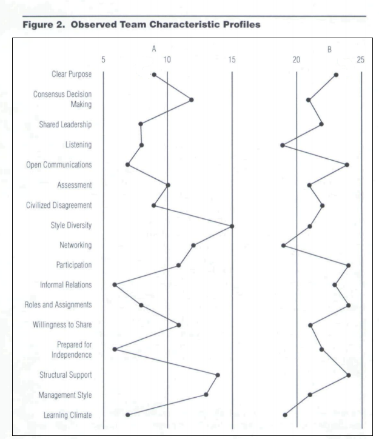

## A Strategic Model
To fulfill the team-building role, managers require a framework to guide activities. The framework should be action oriented and easy to understand and apply, while incorporating the critical factors associated with effective team performance found in the team-building literature. Our purpose in this paper is to provide such a framework in a seven-step process intended to guide managers in their team-building efforts.

### Figure 1: Action Framework for Managers Attempting to Engage in Team Building in intact Groups

1. Identify Team Characteristics Considered Predictive of Team Success
2. Measure Existing Team Climate Characteristics and Produce an Existing Team Profile
3. Identify Deficient Team Characteristics
4. Use Pre-Established Decision Criteria to Select the Appropriate Intervention Sequence to Change Deficient Climate Characteristics
5. Identify Team-building Interventions Capable of Overcoming Deficiencies in Team Characteristics
6. Use Pre-established Decision Criteria to Select the Appropriate Intervention Strategy or Set of Strategies to Improve Deficient Team Characteristics
7. Implement and Assess Improvement

Each step in the framework is discussed in the sections that follow.

Our action framework assumes that managers, during their day-to-day interactions with others and when making decisions affecting their work group, can play a key role in facilitating team development. The framework also assumes that the target group of team building is an intact work group where members (a) work within an organizational context, (b) engage in a number of interrelated work tasks or activities, and (c) are psychologically aware of one another but do not necessarily perform in the same physical location.

### Step 1 — Identify Team Characteristics Considered Predictive of Team Success
Behavioral scientists argue that the success of team-building efforts is a function of the number of desirable team characteristics that can be built into a work environment. The actual mix of factors considered relevant is a function of the type of team being formed (e.g., temporary vs. permanent), tasks performed, the team's level in the organization, the length of time it has been in existence, and the ease of substitutability of existing members.

When forming a new temporary team, the manager is normally interested in the technical and interpersonal skills of potential members that are relevant to the group's tasks, the power distribution of selected members, and whether or not selected members adequately represent relevant constituencies. The key to creating an effective new, temporary team is balance in the attributes of team members, and the presence of needed resources to achieve stated goals. For example, in problem solving and implementation teams, managers must make sure that critical managers with power are selected as members. Therefore, when decisions are made, non-participating managers cannot easily resist. Similarly, managers want to ensure that the required expertise and knowledge exists within the group. This increases the probability of creative problem solving and outcome acceptance by non-members.

In the case of intact groups, where the work unit already exists, management is likely to consider a different set of factors. This happens because intact groups do not allow for easy inter-group transfer and typically engage in tasks that are well established. Consequently, when intact groups are not achieving desired synergies, it is the manager's responsibility to identify those team characteristics likely to have a positive impact on team behavior and change the existing climate so as to remove existing deficiencies.

#### Figure 2: 

***Team characteristics profile***

1. Identify Team Characteristics Considered Predictive of Team Success
2. Measure Existing Team Climate Characteristics and Produce an Existing Team Profile
3. Identify Deficient Team Characteristics
4. Use Pre-Established Decision Criteria to Select the Appropriate Intervention Sequence to Change Deficient Climate Characteristics
4a. Enhance Understanding of the Existing Situation Through:
    - Ongoing observation and interaction with group members and relevant others.
    - Ongoing data collection about organizational culture, structure, systems, process, and politics.
    - Follow-up interviews with group members
    - Analysis of questionnaire subdimensions for further clarification.
5. Identify Team-building Interventions Capable of Overcoming Deficiencies in Team Characteristics
6. Use Pre-established Decision Criteria to Select the Appropriate Intervention Strategy or Set of Strategies to Improve Deficient Team Characteristics
7. Implement and Assess Improvement

Our discussion focuses its attention on team characteristics for intact, permanent groups. Therefore selection issues relating to personality characteristics, skills, or personal power are treated as givens within the existing work environment. Our argument for using this approach is that most managers do not have the luxury of replacing existing group members. Put another way, once employees stay beyond designated trial periods of employment it is difficult to remove them without just cause. Similarly, our discussion treats the group's task and size as givens.

In a foundational article, Hackman argued for the development of a normative model that would identify the factors that most powerfully enhance or depress the task effectiveness of a group and to do so in a way that increases the possibility that constructive change can occur. Studies followed in the 1990s that attempted to address Hackman's call by investigating the relationship between team effectiveness and a variety of contextual, compositional, and team process characteristics. For example, in a study of self-managed work teams, Spreitzer et al. found such team characteristics as coordination, expertise, stability, norms, and innovation related to team effectiveness; Stevens and Campion found conflict resolution skills, collaborative problem solving, communications, goal setting, and performance management practices important for team effectiveness. Taggar and Brown found a positive relationship between a typology of behavior observation scales (BOS) and the performance of problem-solving teams.

Based on this literature brainstorming session by subject matter experts (SMEs), Mealiea identified 12 summary dimensions of team climate and provided preliminary empirical support to the argument that each of the 12 characteristics is significantly related to team performance. A descriptive listing of these dimensions is found in Table 1. The present authors have added another five team characteristics often discussed in the team literature. We believe that team characteristics listed in Table 1 could be used as the basis for assessing team environments.

Most recently, Mealiea and Baltazar found that collaboration, networking, role/goal knowledge, and team orientation explained a significant proportion of variance in such team outcomes as group productive output, team growth, and individual satisfaction.

### Table 1: Team Characteristics Associated with Group Performance

| Team Characteristic | Description |
| --- | --- |
| Clear Purpose | Refers to the condition where group members agree on the group's goals. These shared goals act to spark group effort by providing clear direction and buy-in. |
| Consensus Decision Making | Occurs when groups allow all members to express their opinions and preferences openly and to discuss any disagreement that might exist. |
| Shared Leadership | Occurs when such leadership roles as contributor, collaborator, challenger, facilitator, and controller are carried out by the group members rather than by the group's leader exclusively. |
| Listening | Reflects the willingness of group members to listen to others in an effort to achieve interpersonal understanding and facilitate interpersonal sensitivity. |
| Open Communication | Occurs when group members take advantage of communication opportunities, openly share their feelings, provide timely and relevant feedback, and share relevant information with other group members. |
| Self-Assessment | Allows groups and their members to assess performance, changing environments, and existing goals. |
| Civilized Disagreement | Implies that groups have developed appropriate internal mechanisms and interpersonal sensitivities necessary to manage the full range of conflicts that occur within the groups. |
| Style Diversity | Occurs when group members are not only tolerant of style and behavioral differences but also actively seek out those differences necessary to perform and develop. |
| Networking | Reflects group members' ability and willingness to link up with others external to the group. |
| Participation | By group members in a broad range of group activities and decisions facilitates member buy-in. |
| Informal Relations | Occur within a group environment that can be characterized by a comfortable and relaxed atmosphere. |
| Clear Roles and Assignments | Occur when group members have a clear understanding of their roles and assignments and other group members also agree. |
| Willingness to Share | Allows group members to benefit from the knowledge, experience, emotional support, energy, and tools/equipment possessed by other group members. |
| Prepared for Independence | Increases the probability that group members have the requisite skills necessary to perform required tasks. |
| Structural Support | Creates a work environment designed to facilitate group performance. |
| Leader/Management Style | Relates to the manager's ability to support, encourage, coach, and empower his or her staff. |
| Learning Environment | Relates to the degree to which the group/organizational environment permits group members to learn from their experiences and the experiences of others. |

### Step 2 — Measure Existing Team Climate Characteristics to Produce a Team Profile

- Research shows a link between positive team characteristics and team effectiveness.
- Managers must measure the degree to which relevant team characteristics exist in a given environment.
- This information can be used to create team climate surveys, diagnose team climate, measure team development, and select new team members.

## Methods of Collecting Information

1. **Paper-and-Pencil Questionnaires:**
    - Can be used to assess the existing team climate of intact work groups.
    - Allow managers to effectively assess the perceptions of group members.
    - Require significant time to develop and do not allow for real-time clarification or follow-up questions.

2. **Direct Observation:**
    - Managers spend extended periods of time observing, recording, and assessing pre-identified behavioral dimensions and support behaviors.
    - Effective, but labor-intensive and has the potential to alter the behavior of those being watched.
    - Participants must be willing to be observed.

3. **Interviews:**
    - Allow managers to directly interact with group members, respond to non-verbal cues, and ask follow-up questions.
    - Can be used to supplement information obtained through questionnaires and direct observation.
    - Most effective if well designed, structured, and ask the same question of each participant.

- The objective is to obtain an accurate assessment of the existing environment and construct a team characteristic profile.
